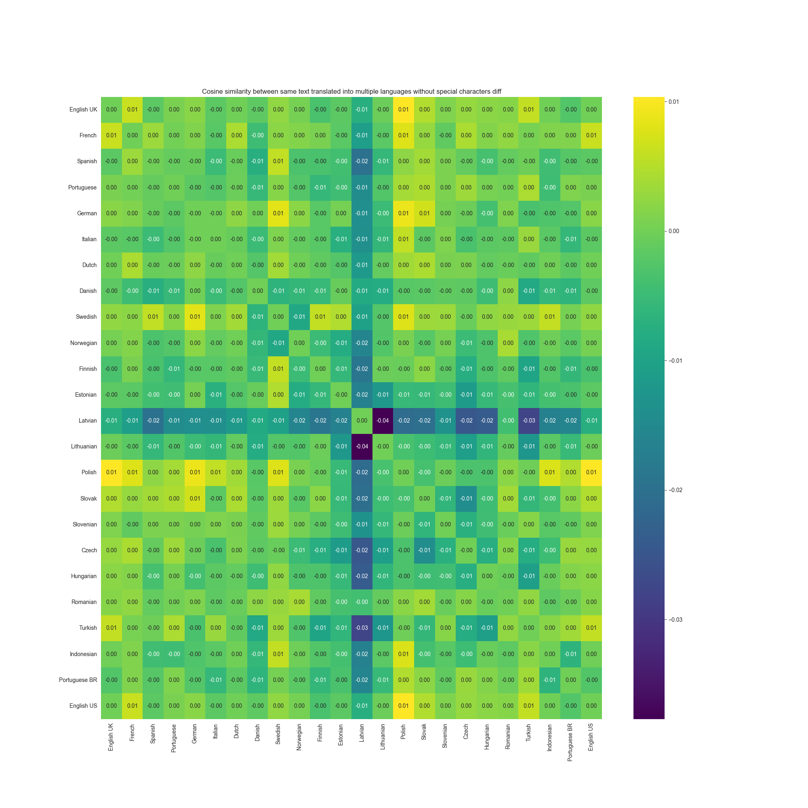

# Analysing how languages affects LLM performance

## Source text

<table>
<tr align="center">
  <td>Strawberry 🍓</td>
  <td>Saturn 🚀</td>
</tr>
<tr>
  <td>
    <pre>
The garden strawberry (or simply strawberry; Fragaria × ananassa) is a widely grown hybrid species of the genus Fragaria, collectively known as the strawberries, which are cultivated worldwide for their fruit. The fruit is widely appreciated for its characteristic aroma, bright red color, juicy texture, and sweetness. It is consumed in large quantities, either fresh or in such prepared foods as jam, juice, pies, ice cream, milkshakes, and chocolates. Artificial strawberry flavorings and aromas are also widely used in products such as candy, soap, lip gloss, perfume, and many others.
The garden strawberry was first bred in Brittany, France, in the 1750s via a cross of Fragaria virginiana from eastern North America and Fragaria chiloensis, which was brought from Chile by Amédée-François Frézier in 1714. Cultivars of Fragaria × ananassa have replaced, in commercial production, the woodland strawberry (Fragaria vesca), which was the first strawberry species cultivated in the early 17th century.
From a botanical point of view, the strawberry is not a berry but an aggregate accessory fruit, meaning that the fleshy part is derived not from the plant's ovaries but from the receptacle that holds the ovaries. Each apparent "seed" (achene) on the outside of the fruit is actually one of the ovaries of the flower, with a seed inside it.
In 2019, world production of strawberries was nine million tons, led by China with 40% of the total.
    </pre>
  </td>
  <td>
<pre>
Saturn V is a retired American super heavy-lift launch vehicle developed by NASA under the Apollo program for human exploration of the Moon. The rocket was human-rated, had three stages, and was powered with liquid fuel. Flown from 1967 to 1973, it was used for nine crewed flights to the Moon, and to launch Skylab, the first American space station.
As of 2023, the Saturn V remains the only launch vehicle to have carried humans beyond low Earth orbit (LEO). Saturn V holds records for the heaviest payload launched and largest payload capacity to low Earth orbit: 311,152 lb (141,136 kg), which included the third stage and unburned propellant needed to send the Apollo command and service module and Lunar Module to the Moon.
The largest production model of the Saturn family of rockets, the Saturn V was designed under the direction of Wernher von Braun at the Marshall Space Flight Center in Huntsville, Alabama; the lead contractors were Boeing, North American Aviation, Douglas Aircraft Company, and IBM. A total of 15 flight-capable vehicles were built, plus three for ground testing. Thirteen were launched from Kennedy Space Center with no loss of crew or payload. A total of 24 astronauts were launched to the Moon from Apollo 8 (December 1968) to Apollo 17 (December 1972).
</pre>
  </td>
</tr>
<tr>
  <td>
    <pre>
Jahodník zahradní (nebo jen jahoda; Fragaria × ananassa) je hojně pěstovaný hybridní druh rodu Fragaria, známý pod souhrnným názvem jahody, který se pěstuje po celém světě pro své plody. Plody jsou široce ceněny pro svou charakteristickou vůni, jasně červenou barvu, šťavnatou strukturu a sladkost. Konzumují se ve velkém množství, a to buď čerstvé, nebo v hotových pokrmech, jako je džem, šťáva, koláče, zmrzlina, mléčné koktejly a čokoláda. Umělá jahodová aromata a příchutě se také hojně používají ve výrobcích, jako jsou cukrovinky, mýdla, lesky na rty, parfémy a mnoho dalších.
Jahodník zahradní byl poprvé vyšlechtěn v Bretani ve Francii v 50. letech 17. století křížením jahodníku Fragaria virginiana z východní části Severní Ameriky a jahodníku Fragaria chiloensis, který přivezl Amédée-François Frézier v roce 1714 z Chile. Kultivary Fragaria × ananassa nahradily v komerční produkci lesní jahodník (Fragaria vesca), který byl prvním druhem jahodníku pěstovaným na počátku 17. století.
Z botanického hlediska není jahoda bobulí, ale agregátním akcesorickým plodem, což znamená, že dužnatá část nepochází z vaječníků rostliny, ale z nádoby, v níž jsou vaječníky uloženy. Každé zdánlivé "semeno" (nažka) na vnější straně plodu je ve skutečnosti jeden z vaječníků květu se semenem uvnitř.
V roce 2019 činila světová produkce jahod devět milionů tun, v čele s Čínou se 40 % celkové produkce.
    </pre>
  </td>
  <td>
   <pre>
   </pre>
  </td>
</tr>
<tr>
  <td>
    <pre>
Суниця садова (або просто полуниця; Fragaria × ananassa) - це широко розповсюджений гібридний вид роду Fragaria, відомий під загальною назвою полуниця, який вирощують у всьому світі через його плоди. Плоди широко цінуються за характерний аромат, яскраво-червоний колір, соковиту консистенцію та солодкість. Її споживають у великих кількостях, як у свіжому вигляді, так і в готових продуктах, таких як джем, сік, пироги, морозиво, молочні коктейлі та шоколадні цукерки. Штучні полуничні ароматизатори та ароматизатори також широко використовуються в таких продуктах, як цукерки, мило, блиск для губ, парфуми та багато інших.
Суниця садова вперше була виведена в Бретані, Франція, в 1750-х роках шляхом схрещування Fragaria virginiana зі східної частини Північної Америки та Fragaria chiloensis, яку привіз з Чилі Амеде-Франсуа Фрезьє в 1714 році. Сорти Fragaria × ananassa замінили в комерційному виробництві лісову суницю (Fragaria vesca), яка була першим видом суниці, культивованим на початку 17 століття.
З ботанічної точки зору, полуниця - це не ягода, а сукупний супліддя, тобто м'ясиста частина походить не з зав'язей рослини, а з квітколожа, в якому містяться зав'язі. Кожна видима "насінина" (сім'янка) на зовнішній стороні плоду насправді є однією з зав'язей квітки, з насіниною всередині.
У 2019 році світове виробництво полуниці склало дев'ять мільйонів тонн, лідером став Китай з 40% від загального обсягу.
    </pre>
  </td>
  <td>
   <pre>
   </pre>
  </td>
</tr>
<tr>
  <td>
    <pre>
花园草莓（或简称草莓；Fragaria × ananassa）是一种广泛种植的草莓属杂交品种，统称草莓，因其果实而在世界各地种植。这种水果因其特有的香气、鲜红的颜色、多汁的口感和甜味而广受欢迎。人们大量食用草莓，无论是新鲜的还是制作成果酱、果汁、馅饼、冰淇淋、奶昔和巧克力等食品。人工草莓香精和香料也广泛用于糖果、肥皂、唇彩、香水等产品中。
花园草莓最早于 17 世纪 50 年代在法国布列塔尼育成，由北美东部的 Fragaria virginiana 和 Amédée-François Frézier 于 1714 年从智利带来的 Fragaria chiloensis 杂交而成。在商业生产中，Fragaria × ananassa 的栽培品种取代了林地草莓（Fragaria vesca），后者是 17 世纪初栽培的第一个草莓品种。
从植物学的角度来看，草莓不是浆果，而是一种聚合附属果实，也就是说，草莓的肉质部分不是来自植物的子房，而是来自容纳子房的花托。果实外面的每一颗表面上的 "种子"（瘦果）实际上是花的一个子房，里面有一颗种子。
2019 年，世界草莓产量为 900 万吨，其中中国占 40%。
    </pre>
  </td>
  <td>
   <pre>
   </pre>
  </td>
</tr>
</table>

## Tokens

#### Lessons learned

* 🇬🇷 needs the most number of tokens from all languages
* 🇬🇧 is the most efficient
* 🇨🇳 is more efficient than some european latin languages

<table>
<tr align="center">
  <td>Strawberry 🍓</td>
  <td>Saturn 🚀</td>
</tr>
<tr>
  <td></td>
  <td></td>
</tr>
</table>

## Number of tokens used with special characters removed

* 🇩🇪 `Gesamtmenge führend war` ➡️ `Gesamtmenge fuhrend war`
* 🇱🇹 `Sodinės braškės pirmą kartą` ➡️ `Sodines braskes pirma karta`
* 🇬🇷 `Η φράουλα κήπου (ή απλά φράουλα, Fragaria × ananassa)` ➡️ `   (  , Fragaria  ananassa)`
    * As you can see this process does not make sanse for some languages

#### Lessons learned

* aaa
* bbb
* ccc

<table>
<tr align="center">
  <td>Strawberry 🍓</td>
  <td>Saturn 🚀</td>
</tr>
<tr>
  <td></td>
  <td></td>
</tr>
</table>

### Percentage change in number of tokens after removal of special characters

For better readability I have removed languages which can't be easily converted to latin characters
🇺🇦,🇬🇷,🇧🇬,🇨🇳,🇰🇷,🇯🇵

#### Lessons learned

* aaa
* bbb
* ccc

<table>
<tr align="center">
  <td>Strawberry 🍓</td>
  <td>Saturn 🚀</td>
</tr>
<tr>
  <td></td>
  <td></td>
</tr>
</table>

---

## Embeddings

In following examples I have computed ADA embeddings for multiple languages anc dompared them with Cosine similarity.

### Comparing cosine similarity between languages

#### Lessons learned

* 🇰🇷 has the lowest similarity across all languages
* 🇳🇴 and 🇩🇰 is very close
    * 🇳🇴 `Hagejordbæret ble først foredlet frem i Bretagne`
    * 🇩🇰 `Havejordbærret blev først avlet i Bretagne`
* 🇨🇿 and 🇸🇰 is close too
    * 🇨🇿 `Jahodník zahradní byl poprvé vyšlechtěn v Bretani ve Francii`
    * 🇸🇰 `Jahoda záhradná bola prvýkrát vyšľachtená v Bretónsku vo Francúzsku`

<table>
<tr align="center">
  <td>Strawberry 🍓</td>
  <td>Saturn 🚀</td>
</tr>
<tr>
  <td></td>
  <td></td>
</tr>
</table>

### Comparing cosine similarity between languages but with special characters removed

#### Lessons learned

* aaa
* bbb
* ccc

<table>
<tr align="center">
  <td>Strawberry 🍓</td>
  <td>Saturn 🚀</td>
</tr>
<tr>
  <td></td>
  <td></td>
</tr>
</table>

### Comparing cosine similarity between same text with and without special characters

#### Lessons learned

* aaa
* bbb
* ccc

### Comparing cosine similarity between completely different texts

#### Lessons learned

* aaa
* bbb
* ccc

---

## Reasoning

### GPT-3.5

* 9 stages SK
* human-powered Greek, not OK overall
* UK very good
* ZH Good

|                  | EN-GB | FR | ES | PT-PT | DE | IT | NL | DA | SV | NB | FI | ET | LV | LT | PL | SK | SL | CS | HU | RO | BG | EL | TR | UK | ZH | KO | JA | ID | PT-BR | EN-US |
|------------------|-------|----|----|-------|----|----|----|----|----|----|----|----|----|----|----|----|----|----|----|----|----|----|----|----|----|----|----|----|-------|-------|
| Number of stages | ❌     | ✅  | ✅  | ✅     | ✅  | ✅  | ✅  | ✅  | ✅  | ✅  | ❌  | ✅  | ✅  | ✅  | ✅  | ❌  | ✅  | ✅  | ✅  | ✅  | ✅  | ✅  | ✅  | ✅  | ✅  | ✅  | ❌  | ✅  | ✅     | ❌     |
| LEO Record       | ❌     | ❌  | ❌  | ❌     | ❌  | ✅  | ✅  | ❌  | ❌  | ❌  | ❌  | ❌  | ❌  | ❌  | ❌  | ❌  | ❌  | ❌  | ❌  | ❌  | ❌  | ❌  | ❌  | ✅  | ❌  | ❌  | ✅  | ❌  | ❌     | ❌     |
| Retired          | ✅     | ✅  | ✅  | ✅     | ✅  | ✅  | ✅  | ✅  | ✅  | ✅  | ❌  | ✅  | ❌  | ✅  | ✅  | ✅  | ✅  | ✅  | ❌  | ✅  | ✅  | ✅  | ✅  | ✅  | ✅  | ❌  | ✅  | ✅  | ✅     | ✅     |
| Human rated      | ✅     | ✅  | ✅  | ✅     | ✅  | ✅  | ✅  | ✅  | ✅  | ✅  | ✅  | ✅  | ✅  | ✅  | ✅  | ❌  | ❌  | ❌  | ✅  | ✅  | ✅  | ❌  | ✅  | ❌  | ✅  | ✅  | ✅  | ✅  | ✅     | ✅     |

### GPT-4

|    | EN-GB | FR | ES | PT-PT | DE | IT | NL | DA | SV | NB | FI | ET | LV | LT | PL | SK | SL | CS | HU | RO | BG | EL | TR | UK | ZH | KO | JA | ID | PT-BR | EN-US |
|----|-------|----|----|-------|----|----|----|----|----|----|----|----|----|----|----|----|----|----|----|----|----|----|----|----|----|----|----|----|-------|-------|
| OK | ✅     | ✅  | ✅  | ✅     | ✅  | ✅  | ✅  | ✅  | ✅  | ✅  | ❌  | ❌  | ❌  | ✅  | ✅  | ✅  | ✅  | ✅  | ✅  | ✅  | ✅  | ✅  | ✅  | ✅  | ✅  | ❌  | ✅  | ✅  | ✅     | ✅     |

* LV decommissioned
* LT has two engines
* SK Falcon 9 remains one of the launch vehicles that have carried humans beyond low Earth orbit (LEO)
* KO alcon 9 is the only launch vehicle to have carried humans beyond low Earth orbit (LEO)