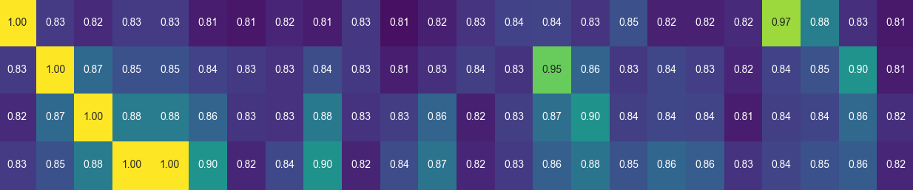

# Analysing how languages affects LLM performance

## Source text

I took two texts and translated them into various languages. 
First text is sample of wikipedia article about [Strawberry](https://en.wikipedia.org/wiki/Strawberry) and second is about [Saturn V](https://en.wikipedia.org/wiki/Saturn_V). 
Below you can see samples of such translations.  

Languages are analysed on order as they are on Earth. English-UK being the first, follwed by France etc.  

<table>
<tr align="center">
  <td>Strawberry 🍓</td>
  <td>Saturn 🚀</td>
</tr>
<tr valign="top">
  <td>
🇬🇧 The garden strawberry (or simply strawberry; Fragaria × ananassa) is a widely grown hybrid species of the genus Fragaria, collectively known as the strawberries, which are cultivated worldwide for their fruit. The fruit is widely appreciated for its characteristic aroma, bright red color, juicy texture, and sweetness. It is consumed in large quantities, either fresh or in such prepared foods as jam, juice, pies, ice cream, milkshakes, and chocolates. Artificial strawberry flavorings and aromas are also widely used in products such as candy, soap, lip gloss, perfume, and many others.
  </td>
  <td>
🇬🇧 Saturn V is a retired American super heavy-lift launch vehicle developed by NASA under the Apollo program for human exploration of the Moon. The rocket was human-rated, had three stages, and was powered with liquid fuel. Flown from 1967 to 1973, it was used for nine crewed flights to the Moon, and to launch Skylab, the first American space station.
  </td>
</tr>
<tr valign="top">
  <td>
🇨🇿 Jahodník zahradní (nebo jen jahoda; Fragaria × ananassa) je hojně pěstovaný hybridní druh rodu Fragaria, známý pod souhrnným názvem jahody, který se pěstuje po celém světě pro své plody. Plody jsou široce ceněny pro svou charakteristickou vůni, jasně červenou barvu, šťavnatou strukturu a sladkost. Konzumují se ve velkém množství, a to buď čerstvé, nebo v hotových pokrmech, jako je džem, šťáva, koláče, zmrzlina, mléčné koktejly a čokoláda. Umělá jahodová aromata a příchutě se také hojně používají ve výrobcích, jako jsou cukrovinky, mýdla, lesky na rty, parfémy a mnoho dalších.
  </td>
  <td>
🇨🇿 Saturn V je vyřazená americká supertěžká nosná raketa vyvinutá NASA v rámci programu Apollo pro výzkum Měsíce lidmi. Raketa byla určena pro lidi, měla tři stupně a byla poháněna kapalným palivem. Létala v letech 1967 až 1973 a byla použita k devíti letům na Měsíc s posádkou a k vynesení Skylabu, první americké vesmírné stanice.
  </td>
</tr>
<tr valign="top">
  <td>
🇺🇦 Суниця садова (або просто полуниця; Fragaria × ananassa) - це широко розповсюджений гібридний вид роду Fragaria, відомий під загальною назвою полуниця, який вирощують у всьому світі через його плоди. Плоди широко цінуються за характерний аромат, яскраво-червоний колір, соковиту консистенцію та солодкість. Її споживають у великих кількостях, як у свіжому вигляді, так і в готових продуктах, таких як джем, сік, пироги, морозиво, молочні коктейлі та шоколадні цукерки. Штучні полуничні ароматизатори та ароматизатори також широко використовуються в таких продуктах, як цукерки, мило, блиск для губ, парфуми та багато інших.
 </td>
  <td>
🇺🇦 Сатурн V - списана американська ракета-носій надважкого класу, розроблена НАСА в рамках програми "Аполлон" для дослідження Місяця людиною. Ракета була розрахована на людей, мала три ступені і працювала на рідкому паливі. З 1967 по 1973 рік вона використовувалася для дев'яти пілотованих польотів на Місяць, а також для запуску першої американської космічної станції "Скайлаб".
  </td>
</tr>
<tr valign="top">
  <td>
🇨🇳 花园草莓（或简称草莓；Fragaria × ananassa）是一种广泛种植的草莓属杂交品种，统称草莓，因其果实而在世界各地种植。这种水果因其特有的香气、鲜红的颜色、多汁的口感和甜味而广受欢迎。人们大量食用草莓，无论是新鲜的还是制作成果酱、果汁、馅饼、冰淇淋、奶昔和巧克力等食品。人工草莓香精和香料也广泛用于糖果、肥皂、唇彩、香水等产品中。
  </td>
  <td>
🇨🇳 土星五号是美国国家航空航天局（NASA）在阿波罗计划中为人类探索月球而研制的超重型运载火箭，现已退役。该火箭为载人火箭，共有三级，以液体燃料为动力。从 1967 年到 1973 年，它曾九次载人飞往月球，并发射了美国第一个空间站 Skylab。
  </td>
</tr>
</table>

## Tokens

I analysed number of GPT tokens needed to represent input text in various languages. 

#### Lessons learned

* 🇬🇷 needs the most number of tokens from all languages
* 🇬🇧 is the most efficient
* 🇨🇳 is more efficient than some european latin languages

<table>
<tr align="center">
  <td>Strawberry 🍓</td>
  <td>Saturn 🚀</td>
</tr>
<tr>
  <td>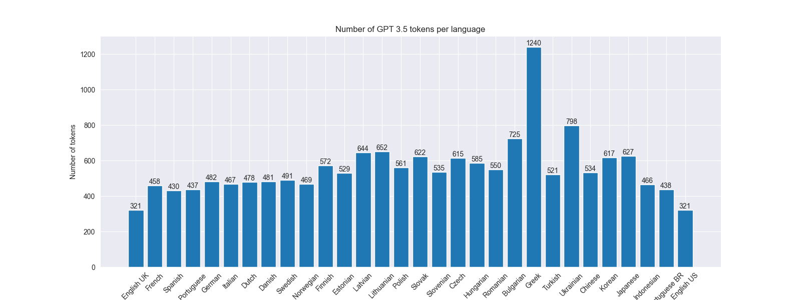</td>
  <td>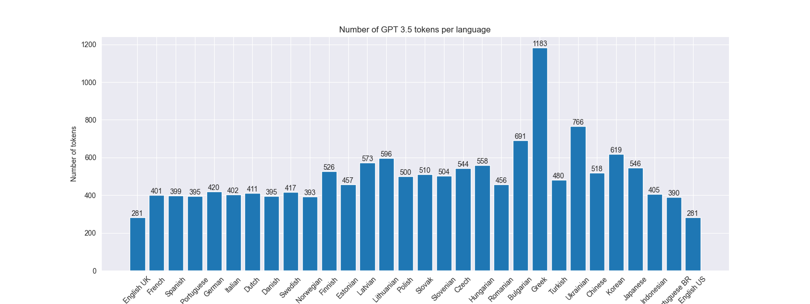</td>
</tr>
</table>

## Number of tokens used with diacritic removed

I analysed how many GPT tokens can be saved when we remove diacritic.

Some languages are affected more than others: 
* 🇩🇪 `Gesamtmenge führend war` ➡️ `Gesamtmenge fuhrend war`
* 🇱🇹 `Sodinės braškės pirmą kartą` ➡️ `Sodines braskes pirma karta`
* 🇬🇷 `Η φράουλα κήπου (ή απλά φράουλα, Fragaria × ananassa)` ➡️ `   (  , Fragaria  ananassa)`
    * As you can see this process does not make sense for some languages

#### Lessons learned

* Nothing remains from text translated to asian languages
* Most European languages are mostly unaffected

<table>
<tr align="center">
  <td>Strawberry 🍓</td>
  <td>Saturn 🚀</td>
</tr>
<tr>
  <td>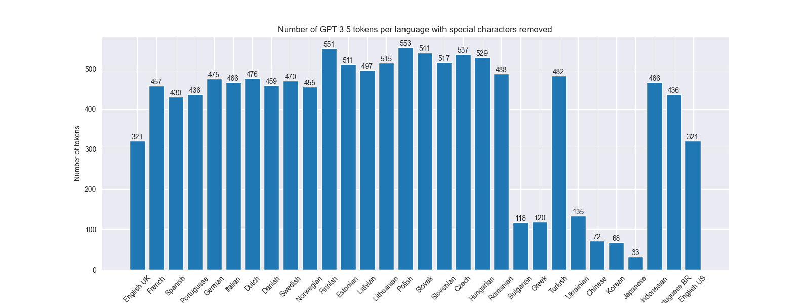</td>
  <td>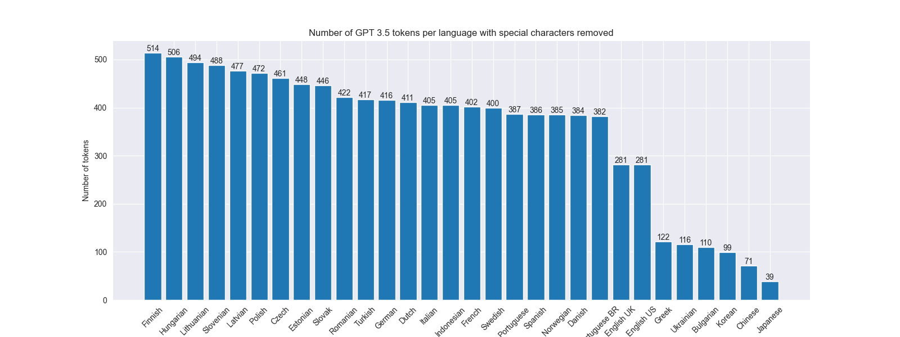</td>
</tr>
</table>

### Percentage change in number of tokens after removal of special characters

For better readability I have removed languages which can't be easily converted to latin characters
🇺🇦,🇬🇷,🇧🇬,🇨🇳,🇰🇷,🇯🇵

#### Lessons learned

* Lithuanian and Latvian languages are affected the most
* German is affected very little

<table>
<tr align="center">
  <td>Strawberry 🍓</td>
  <td>Saturn 🚀</td>
</tr>
<tr>
  <td>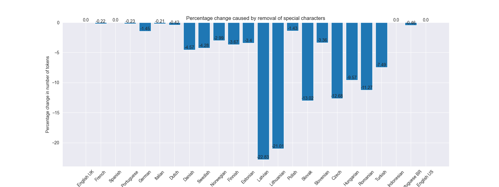</td>
  <td>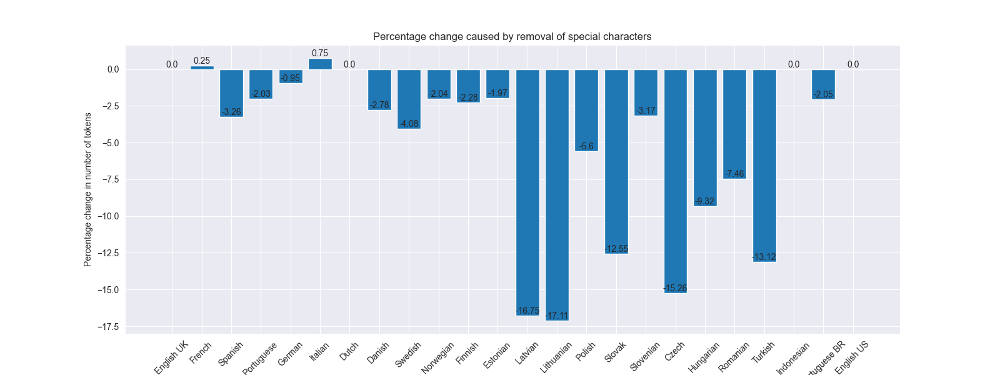</td>
</tr>
</table>

---

## Embeddings

In following examples I have computed ADA embeddings for multiple languages and compared them with Cosine similarity.

### Comparing cosine similarity between languages

#### Lessons learned

* 🇰🇷 has the lowest similarity across all languages in text about Strawberry
* Asian languages have big distance with other languages in text about Saturn V
* 🇳🇴 and 🇩🇰 is very close
    * 🇳🇴 `Hagejordbæret ble først foredlet frem i Bretagne`
    * 🇩🇰 `Havejordbærret blev først avlet i Bretagne`
* 🇨🇿 and 🇸🇰 is close too
    * 🇨🇿 `Jahodník zahradní byl poprvé vyšlechtěn v Bretani ve Francii`
    * 🇸🇰 `Jahoda záhradná bola prvýkrát vyšľachtená v Bretónsku vo Francúzsku`

<table>
<tr align="center">
  <td>Strawberry 🍓</td>
  <td>Saturn 🚀</td>
</tr>
<tr>
  <td>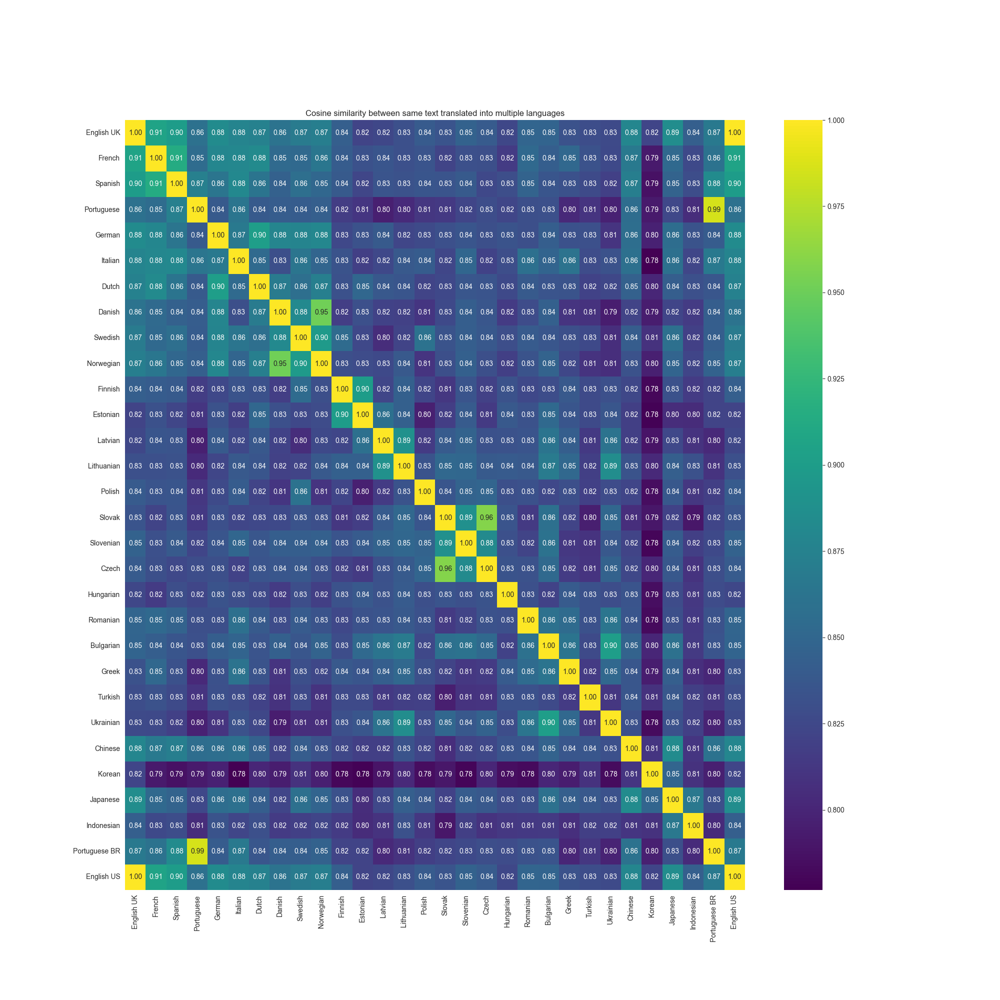</td>
  <td>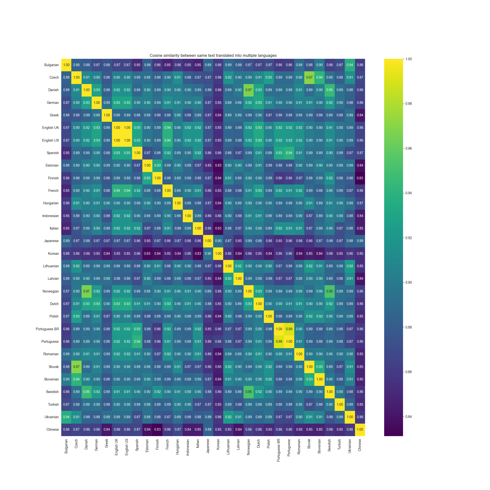</td>
</tr>
</table>

### Comparing cosine similarity between languages but with diacritic removed

I analysed how much embeddings differ if we remove diacritic 

#### Lessons learned

* aaa
* bbb
* ccc

<table>
<tr align="center">
  <td>Strawberry 🍓</td>
  <td>Saturn 🚀</td>
</tr>
<tr>
  <td>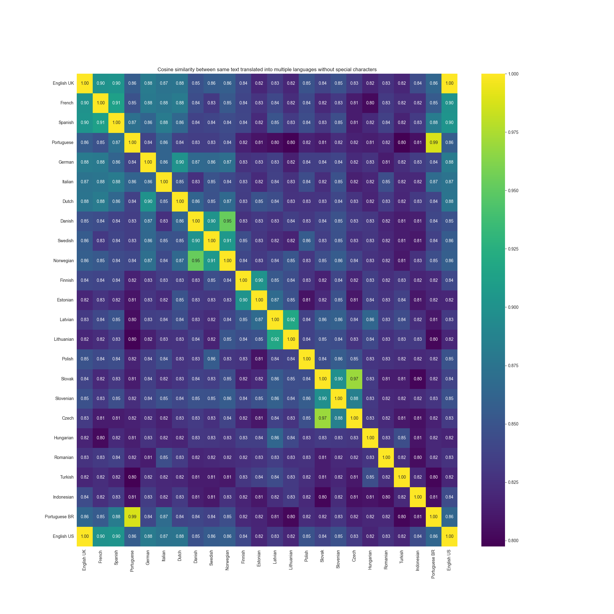</td>
  <td>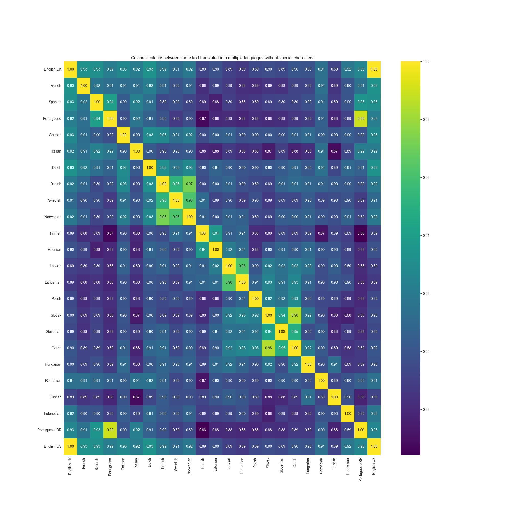</td>
</tr>
</table>

### Comparing cosine similarity between same text with and without special characters

Here you can see the difference between Cosine similarity with embeddings computed
on original texts which contain diacritic and embeddings computed on texts with diacritic removed.

#### Lessons learned

* Latvian is affected the most
* Different texts are affected differently

<table>
<tr align="center">
  <td>Strawberry 🍓</td>
  <td>Saturn 🚀</td>
</tr>
<tr>
  <td>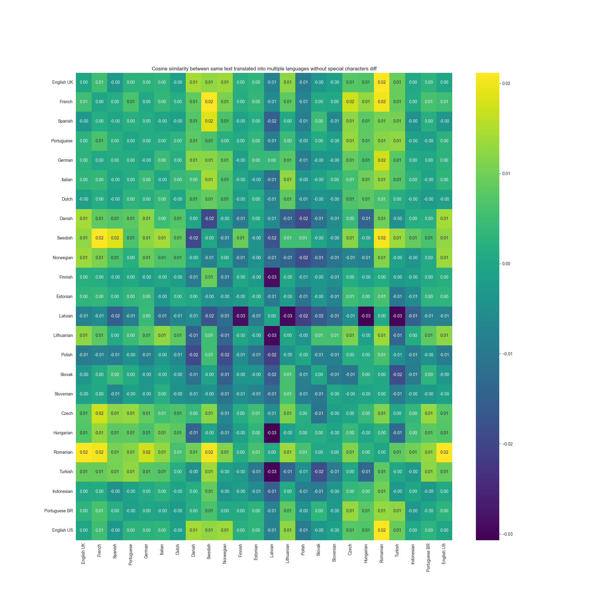</td>
  <td>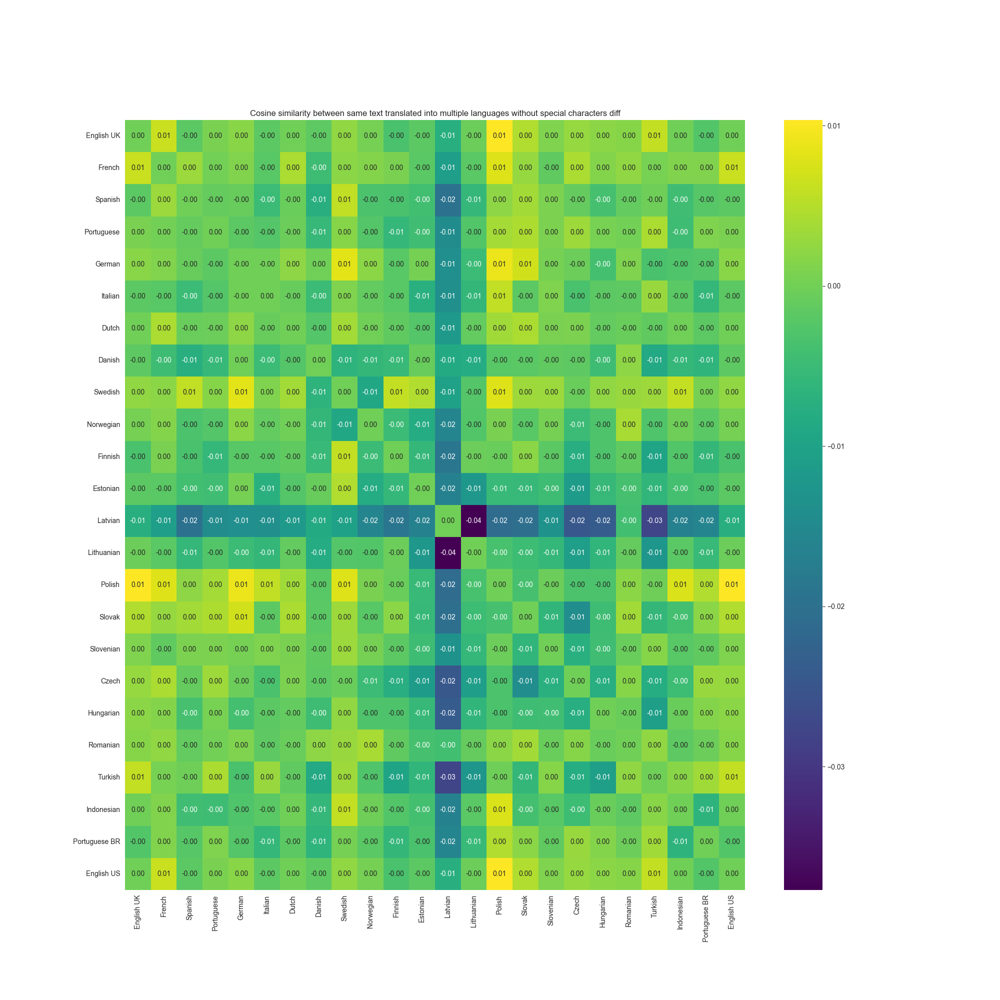</td>
</tr>
</table>

### Comparing cosine similarity between completely different texts

Here I compared embeddings of text about Strawberry with text about Saturn V
to check what could be the maximum difference.

#### Lessons learned

* No language has zero distance to different texts
* English has the lowest values
* European languages have higher values

---

## Reasoning

### GPT-3.5

* 9 stages SK
* human-powered Greek, not OK overall
* UK very good
* ZH Good

|                  | EN-GB | FR | ES | PT-PT | DE | IT | NL | DA | SV | NB | FI | ET | LV | LT | PL | SK | SL | CS | HU | RO | BG | EL | TR | UK | ZH | KO | JA | ID | PT-BR | EN-US |
|------------------|-------|----|----|-------|----|----|----|----|----|----|----|----|----|----|----|----|----|----|----|----|----|----|----|----|----|----|----|----|-------|-------|
| Number of stages | ❌     | ✅  | ✅  | ✅     | ✅  | ✅  | ✅  | ✅  | ✅  | ✅  | ❌  | ✅  | ✅  | ✅  | ✅  | ❌  | ✅  | ✅  | ✅  | ✅  | ✅  | ✅  | ✅  | ✅  | ✅  | ✅  | ❌  | ✅  | ✅     | ❌     |
| LEO Record       | ❌     | ❌  | ❌  | ❌     | ❌  | ✅  | ✅  | ❌  | ❌  | ❌  | ❌  | ❌  | ❌  | ❌  | ❌  | ❌  | ❌  | ❌  | ❌  | ❌  | ❌  | ❌  | ❌  | ✅  | ❌  | ❌  | ✅  | ❌  | ❌     | ❌     |
| Retired          | ✅     | ✅  | ✅  | ✅     | ✅  | ✅  | ✅  | ✅  | ✅  | ✅  | ❌  | ✅  | ❌  | ✅  | ✅  | ✅  | ✅  | ✅  | ❌  | ✅  | ✅  | ✅  | ✅  | ✅  | ✅  | ❌  | ✅  | ✅  | ✅     | ✅     |
| Human rated      | ✅     | ✅  | ✅  | ✅     | ✅  | ✅  | ✅  | ✅  | ✅  | ✅  | ✅  | ✅  | ✅  | ✅  | ✅  | ❌  | ❌  | ❌  | ✅  | ✅  | ✅  | ❌  | ✅  | ❌  | ✅  | ✅  | ✅  | ✅  | ✅     | ✅     |

### GPT-4

|    | EN-GB | FR | ES | PT-PT | DE | IT | NL | DA | SV | NB | FI | ET | LV | LT | PL | SK | SL | CS | HU | RO | BG | EL | TR | UK | ZH | KO | JA | ID | PT-BR | EN-US |
|----|-------|----|----|-------|----|----|----|----|----|----|----|----|----|----|----|----|----|----|----|----|----|----|----|----|----|----|----|----|-------|-------|
| OK | ✅     | ✅  | ✅  | ✅     | ✅  | ✅  | ✅  | ✅  | ✅  | ✅  | ❌  | ❌  | ❌  | ✅  | ✅  | ✅  | ✅  | ✅  | ✅  | ✅  | ✅  | ✅  | ✅  | ✅  | ✅  | ❌  | ✅  | ✅  | ✅     | ✅     |

* LV decommissioned
* LT has two engines
* SK Falcon 9 remains one of the launch vehicles that have carried humans beyond low Earth orbit (LEO)
* KO alcon 9 is the only launch vehicle to have carried humans beyond low Earth orbit (LEO)